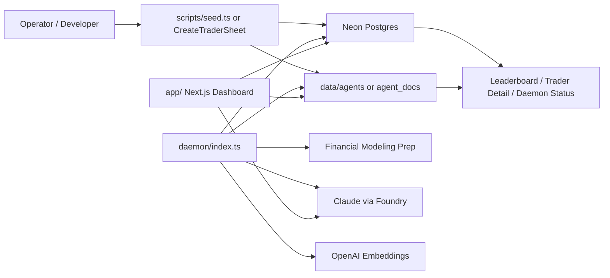

# CLAUDE.md

This file is the canonical repository guide for Claude Code and human collaborators. It combines operator instructions, architecture notes, and an implementation-level explanation of how AiphaLab actually works today.

The goal is not to restate `README.md`. The goal is to explain the current codebase truth, including places where the intended design and the actual implementation differ.

## What This Repo Is

AiphaLab is not a general-purpose agent framework, and it is not a real brokerage-integrated quant stack.

It is, in practice:

**A two-process stock-market simulation where LLMs play the role of distinct traders with persona, memory, and evolving strategy, and a daemon runs their paper-trading lifecycle in fixed market phases.**

The system has two kinds of state:

- Soul state:
  - `identity.md`
  - `strategy.md`
  - `beliefs.json`
  - daily journals
- Execution state:
  - cash
  - positions
  - trades
  - daily snapshots
  - episodic memories
  - evolution logs

The LLM does not write directly to the database and does not talk to a real broker. It only produces three kinds of judgments:

- market-open trade decisions
- after-hours daily reviews
- intraday alert responses

Actual execution is handled by `SimulatedBroker`. Persistence is handled by `SimDB`. Time-driven orchestration is handled by the daemon.

## Quick Commands

```bash
# Local development (two terminals)
pnpm dev          # Next.js dashboard on :3000
pnpm daemon:dev   # daemon with hot reload

# Run a single daemon phase manually
pnpm daemon -- --phase preMarket --date 2025-01-06
# phases: preMarket | marketOpen | midday | marketClose | afterHours | weeklyReview

# Database + initialization
pnpm migrate
pnpm seed -- --n 5

# Legacy/manual simulation entry points
pnpm run -- --date 2025-01-06
pnpm tsx scripts/backfill.ts --from 2025-01-02 --to 2025-01-31 --agents 5

# Validation
pnpm typecheck
pnpm build
```

## Environment Variables

Copy `.env.local.example` to `.env.local`:

| Variable | Required | Purpose |
|----------|----------|---------|
| `DATABASE_URL` | yes | Neon Postgres connection string |
| `FMP_API_KEY` | yes | Financial Modeling Prep market and ratio data |
| `ANTHROPIC_FOUNDRY_API_KEY` | yes | Azure Foundry API key |
| `ANTHROPIC_FOUNDRY_BASE_URL` | yes | Azure Foundry Anthropic base URL |
| `OPENAI_API_KEY` | no | Embeddings; if absent, the app falls back to zero vectors |
| `FILESTORE_BACKEND=pg` | strongly recommended in prod | Store soul docs in `agent_docs` instead of local disk |

Important production note:

- **Set `FILESTORE_BACKEND=pg` on both Railway and Vercel.**
- If only Railway is configured and Vercel is not, the daemon and the dashboard can read from different document backends.

## Runtime Topology

### Two-process model

```text
pnpm dev    -> app/          Next.js dashboard + API routes
pnpm daemon -> daemon/       long-running scheduler / trading engine
              lib/           shared business layer
              data/agents/   local soul files in dev
```

### Process roles

- `app/`
  - dashboard pages
  - read APIs
  - also includes trader generation/creation endpoints
- `daemon/`
  - long-running scheduler
  - executes market phases in ET
  - owns the trading lifecycle
- `lib/`
  - shared business layer: DB, broker, signals, LLM, embeddings, file store
- `data/agents/`
  - local soul docs in development
- Neon Postgres
  - execution-state source of truth
  - also stores `agent_docs` in the intended production setup
- External services
  - FMP for quotes, OHLC, and ratios
  - Claude via Foundry for decisions, journals, and evolution
  - OpenAI embeddings for episodic memory retrieval

### Topology diagram



## Core Modules

| File | Purpose |
|------|---------|
| `lib/db/repository.ts` | `SimDB`, the main DB access layer |
| `lib/db/schema.ts` | DDL and migration helper |
| `lib/fileStore.ts` | `IFileStore`, `FileStore`, `PgFileStore`, `getFileStore()` |
| `lib/agent.ts` | `TraderAgent`: `runDecisionPhase()`, `runReviewPhase()`, `respondToAlert()` |
| `lib/broker.ts` | `SimulatedBroker` paper-trading engine |
| `lib/llm.ts` | text generation and structured JSON generation via Claude |
| `lib/fmp.ts` | FMP API wrapper with in-process caching |
| `lib/signals.ts` | deterministic value + momentum signals |
| `lib/embeddings.ts` | embeddings client with zero-vector fallback |
| `lib/persona.ts` | persona generation and markdown formatting for seed flows |
| `daemon/index.ts` | daemon entry, scheduler, heartbeat, price monitor |
| `daemon/phases/*.ts` | phase orchestrators |
| `daemon/evolutionEngine.ts` | weekly evolution logic |
| `components/CreateTraderSheet.tsx` | UI-side trader creation flow |

## Data Model

### Execution state in Postgres

| Table | Role |
|---|---|
| `agents` | trader metadata |
| `agent_state` | current cash, portfolio value, pnl, last run date, run count |
| `positions` | current holdings |
| `trades` | trade history |
| `daily_snapshots` | end-of-day portfolio snapshots |
| `agent_memories` | journal-derived episodic memories |
| `phase_log` | phase progress and recovery markers |
| `price_alerts` | intraday spike alerts |
| `evolution_log` | strategy/identity evolution history |
| `daemon_heartbeat` | daemon liveness and current phase |
| `simulation_log` | legacy/manual simulation runs |
| `agent_docs` | production-oriented storage for soul docs |

### Soul state in docs

Each agent has four soul artifacts:

- `identity.md`
- `strategy.md`
- `beliefs.json`
- `journal/YYYY-MM-DD.md`

Local-dev path:

- `data/agents/agent_001/`

Production-intended path:

- `agent_docs`

Key modeling decision:

**The database stores objective execution state. The docs store persona, subjective beliefs, and reflective memory.**

That is the main reason this feels like an agent simulation instead of a normal backtest app.

## End-to-End Flow

### 1. Trader creation

There are two creation paths.

#### Batch seed path

File: `scripts/seed.ts`

Flow:

1. Generate personas with `lib/persona.ts`
2. For each persona:
   - insert into `agents`
   - initialize `agent_state`
   - write `identity.md`
   - write `strategy.md`
   - initialize `beliefs.json`
3. If `DATABASE_URL` is set, also write to `agent_docs`

This means seeded traders are created as soul-first entities, then given execution state.

#### UI authoring path

Files:

- `components/CreateTraderSheet.tsx`
- `app/api/agents/generate-identity/route.ts`
- `app/api/agents/generate-strategy/route.ts`
- `app/api/agents/create/route.ts`

Flow:

1. User chooses an archetype in the UI
2. Next API calls Claude to generate `identity.md`
3. Next API calls Claude again to generate `strategy.md`
4. Create endpoint:
   - inserts `agents`
   - initializes `agent_state`
   - writes docs through `PgFileStore` to `agent_docs`

This is important: the dashboard is not purely read-only. It also acts as a lightweight trader authoring console.

### 2. preMarket (09:00 ET)

File: `daemon/phases/preMarket.ts`

Flow:

1. Load all active agents
2. Read each agent's `strategy.md`
3. Extract ticker-like tokens from text
4. Union unique tickers, capped at 200
5. Compute deterministic signals in `lib/signals.ts`
6. Store the result in an in-memory module cache

Signals are not LLM-generated. They are numeric features such as:

- P/E
- P/B
- current ratio
- dividend yield
- EPS trend
- 12-1 momentum

### 3. marketOpen (09:35 ET)

Files:

- `daemon/phases/marketOpen.ts`
- `lib/agent.ts`
- `lib/broker.ts`

Per-agent flow:

1. Rebuild `SimulatedBroker` from DB state
2. Check stop-losses once
3. Load soul docs
4. Retrieve up to 5 episodic memories
5. Build a decision prompt
6. Call Claude for `TradingDecision[]`
7. Execute BUY/SELL via broker
8. Update beliefs
9. Persist trades and positions

### 4. midday (12:30 ET)

File: `daemon/phases/midday.ts`

Current behavior:

- re-check trailing stop-losses
- sell if a stop is triggered
- update beliefs

There is no second full LLM decision pass at midday.

### 5. marketClose (15:55 ET)

File: `daemon/phases/marketClose.ts`

Flow:

1. Recompute portfolio value
2. write `daily_snapshots`
3. update `agent_state`

No journal writing. No LLM call.

### 6. afterHours (16:30 ET)

Files:

- `daemon/phases/afterHours.ts`
- `lib/agent.ts`

Per-agent flow:

1. Load today's trades, latest snapshot, and soul docs
2. Compute `dailyReturn` and `cumulativeReturn`
3. write `daily_snapshots` again
4. update `agent_state`
5. Call Claude for `DayReview`
6. write `journal/YYYY-MM-DD.md`
7. embed `fullReview`
8. insert into `agent_memories`

### 7. weeklyReview (Sunday 20:00 ET)

Files:

- `daemon/phases/weeklyReview.ts`
- `daemon/evolutionEngine.ts`

Flow:

1. Compute ~35-day performance windows
2. classify underperformers and overperformers
3. evolve at most 20 agents
4. rewrite `strategy.md` via Claude
5. lightly adjust `identity.md` via Claude
6. log changes in `evolution_log`

### 8. priceMonitor (every 5 minutes during market hours)

File: `daemon/priceMonitor.ts`

Flow:

1. Collect all currently held tickers
2. Fetch batch quotes
3. Compare current quote vs prior observation
4. If move exceeds 3%, insert into `price_alerts`
5. Find agents holding that ticker
6. call `respondToAlert()`

`respondToAlert()` asks the model to choose:

- `SELL`
- `HOLD`
- `SCALE`

Current execution reality:

- `SELL` is implemented (sells full position)
- `HOLD` does nothing (maintains position)
- `SCALE` is implemented (adds 10% of available cash via `broker.addToPosition`)

## Agent Runtime: What the Model Actually Sees

### Inputs at market open

`runDecisionPhase()` gives the model:

- `identity.md`
- `strategy.md`
- full `beliefs.json`
- the 3 most recent journals
- up to 5 retrieved episodic memories
- current cash and position count
- SPY 1d / 5d context
- VIX level with fear interpretation
- market regime
- top buy candidates from cached signals (with confidence scores)
- current holdings with signal summaries (with confidence scores)

### Inputs after hours

`runReviewPhase()` gives the model:

- `identity.md`
- `strategy.md`
- today's trades
- current portfolio value, cash, and position count
- `dailyReturn`
- market context

### Inputs during price alerts

`respondToAlert()` gives the model:

- current `strategy.md`
- that ticker's current belief
- alert type
- current price

### Important data the model does not currently receive

The model does **not** currently see:

- news streams
- macro event calendars
- raw financial tables
- whole-market scanner outputs
- full per-position pnl analytics
- real order book / market microstructure
- other agents' behavior

So the current agent is best understood as:

**A persona-and-memory-conditioned strategy interpreter with a limited market summary, not a fully autonomous market reasoner.**

## Frontend / Backend Cooperation

### Homepage

`app/page.tsx` depends on:

- `useLeaderboard()`
  - polls `/api/leaderboard`
- `useSimulationStatus()`
  - polls `/api/simulation/status`
  - polls `/api/daemon/status`

So the homepage is pull-based:

- daemon writes state
- frontend polls for the latest state

There is no push channel and no event bus.

### Trader detail page

`app/traders/[id]/page.tsx` is a server component. It directly loads:

- `agents`
- `agent_state`
- `daily_snapshots`
- `trades`
- `positions`
- `identity.md`
- `beliefs.json`
- `strategy.md`
- latest journal

It then assembles persona, review, equity curve, open positions, beliefs, and trade history.

### Actual system boundary

The idealized story is:

- dashboard reads only
- daemon writes everything

The actual code is more nuanced:

- trading-state mutations mostly happen in the daemon
- trader generation and trader creation partly happen in Next API routes
- dashboard pages mostly read state from DB and doc storage

## What The Current Agent Framework Does Not Support

The current runtime **does not support** "provide a tool/skill set and let the agent decide whether to call tools".

Why:

- `lib/llm.ts` only exposes plain generation and structured JSON generation
- there is no tool registry
- there is no function-calling or tool-call schema
- there is no multi-step observe -> tool call -> observe -> final answer loop
- `runDecisionPhase()` is a single prompt -> final `TradingDecision[]` pass

The current pattern is:

- host code prepares context
- model returns final JSON

If this repo is ever extended to tool-using agents, the right direction is:

- add a `ToolRegistry`
- define skill packs as prompt policy + allowed tools
- make `runDecisionPhase()` a bounded multi-step loop
- keep `SimulatedBroker` as the only write/execution boundary

## Implementation Caveats And Non-Obvious Truths

These caveats matter. Do not reason about the system from README-level intent alone.

### 1. The frontend is not actually read-only

Current Next APIs perform writes:

- generate `identity.md`
- generate `strategy.md`
- create traders

So the dashboard layer is also a lightweight control plane.

### 2. The `FileStore` abstraction is bypassed in several places

The intended rule is "always use `getFileStore()`".  
In practice, some pages and APIs directly instantiate `FileStore`, and some creation logic directly instantiates `PgFileStore`.

Implications:

- with `FILESTORE_BACKEND=pg`, parts of the app may still read local disk
- traders created through the UI may exist in `agent_docs` but not under `data/agents`
- the daemon and dashboard can observe different soul-doc sources

### 3. `simulation_log` is not the daemon scheduler's source of truth

The homepage simulation status comes from `simulation_log`.  
That table is mainly written by:

- `scripts/run.ts`
- `scripts/backfill.ts`

It does not represent the full real-time scheduler lifecycle.

Actual daemon liveness comes from:

- `daemon_heartbeat`

### 4. preMarket signals live only in memory (with fallback)

The pre-market signal cache currently lives only in a module-level `_cache` in `daemon/phases/preMarket.ts`.

Implications:

- daemon restart loses the cache
- **however**, `marketOpen` now auto-runs `runPreMarket()` on-demand if the cache is missing or stale
- manual phase runs can bypass signal preparation, but `marketOpen` will self-heal

### 5. Identity parameters are wired into all entry points

`identity.md` contains fields like:

- decision temperature (clamped to 0.1–0.95)
- conviction multiplier (clamped to 0.3–2.5)

The evolution engine edits these values, and they are now parsed via `parseAgentParams()` in all entry points:
- daemon phases (`marketOpen`, `afterHours`, `priceMonitor`)
- manual scripts (`run.ts`, `backfill.ts`)

Parameters are bounds-checked to prevent invalid values from the evolution engine.

### 6. `SCALE` is implemented

The alert schema supports `SCALE`, and execution logic adds 10% of available cash to the position via `broker.addToPosition()`.

### 7. Price alerts are not modeled as per-agent work items

`price_alerts` does not carry an `agent_id`.  
If one alert is marked processed early, later holders of the same ticker may never see it.

### 8. The same-day snapshot can be written twice

`marketClose` writes `daily_snapshots`.  
`runReviewPhase()` writes `daily_snapshots` again using `ON CONFLICT DO UPDATE`.

So snapshots are not a single immutable end-of-day event.

### 9. Embeddingless mode degrades episodic memory substantially

If `OPENAI_API_KEY` is absent:

- inserts use zero vectors
- retrieval queries use zero vectors

The app still runs, but memory retrieval is close to semantically meaningless.

## Working Rules For Future Changes

### FileStore

- Prefer `getFileStore()`
- Do not instantiate `FileStore` / `PgFileStore` directly outside carefully justified cases

### Broker boundary

- Treat `SimulatedBroker` as the only trading execution boundary
- Do not let the LLM decide raw DB writes

### Prompt design

- Do not dump raw news, raw tables, or oversized context directly into prompts
- Summarize and structure context first
- If market context grows, move toward a formal `DecisionContext` instead of endlessly expanding prompt text blobs

### Mutation boundaries

- It is acceptable for the UI layer to keep trader-authoring endpoints
- But mutations should be explicit about whether they are dashboard mutations or daemon lifecycle mutations

### Rate limiting

- Daemon-side LLM calls must go through `llmBucket.waitForToken()`
- High-volume market-data expansions should respect a similar budgeted pattern

## Deployment

| Service | Command | Env vars needed |
|---------|---------|----------------|
| Vercel (Next.js) | `pnpm build` auto | `DATABASE_URL`, `FILESTORE_BACKEND=pg`, `ANTHROPIC_FOUNDRY_API_KEY`, `ANTHROPIC_FOUNDRY_BASE_URL` |
| Railway (daemon) | `pnpm daemon` | all of the above plus `FMP_API_KEY` |

Run migrations before first deploy:

```bash
DATABASE_URL=<neon_url> pnpm migrate
```

## Bottom Line

If you need the most accurate one-line summary of this repo:

> A document-driven AI trader society simulator built on a database-backed execution engine, with daemon phases controlling behavior and LLMs generating decisions, reflection, and strategy evolution.
